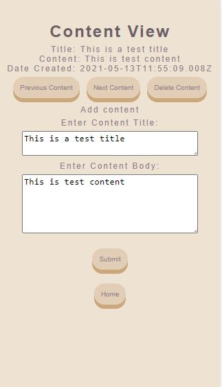
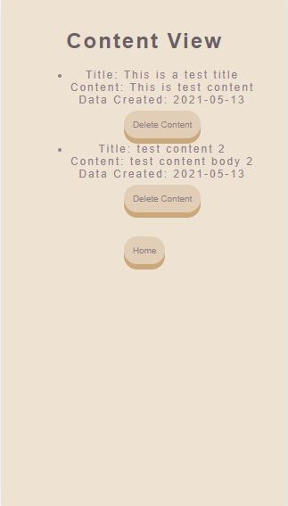
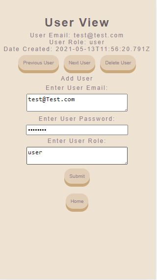
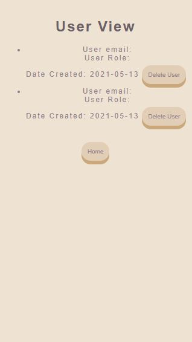

## Content Management System

### To run the CMS
1. Clone the Git repo to your local directory
2. Move to the root directory and run ```npm install```
3. Ensure postgres is installed, then create a postgres user with creation permissions.
4. Create the databases, extensions and tables as per the instructions [here](db-schema.sql)
5. Create .env file with variables PG_USER, PG_PASSWORD (use the credentials for the postgres user set up in step 3), PORT (use pg default port) and
NODE_ENV=production
6. To run the app go to the parent directory and run ```npm start```

### Screenshots






##### Tests
- Express API back end test coverage:

File         | % Stmts | % Branch | % Funcs | % Lines | Uncovered Line #s
-------------|---------|----------|---------|---------|---------------------
All files    |   91.78 |    95.45 |     100 |   91.78 |
 database.js |     100 |       50 |     100 |     100 | 9
 index.js    |   91.18 |      100 |     100 |   91.18 | 20,32,75,89,101,144


### Tech used:
- Express for APIs
- Postgres for the database
  - Postgres extension pgcrypto for encryption
- Jest to test back end
- React for the front end (create-react-app)
- Jest/React Testing Library to test the front end

### Restful APIs
- Content
  - GET /content/:id (get one content post)
  - GET /content/ (get all content)
  - POST /content/add (add one content post)
  - PUT /content/:id (update one content post)
  - DELETE /content/:id (delete one content post)

- Users
  - GET /users/:id (get one user record)
  - GET /users/ (get all users)
  - POST /users/add (add one user record)
  - PUT /users/:id (update one user record)
  - DELETE /users/:id (delete one user record)
