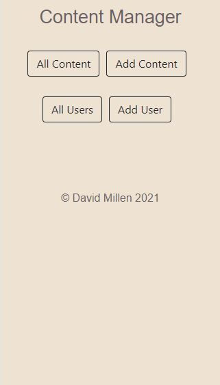
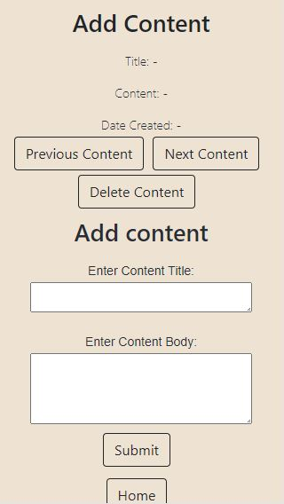
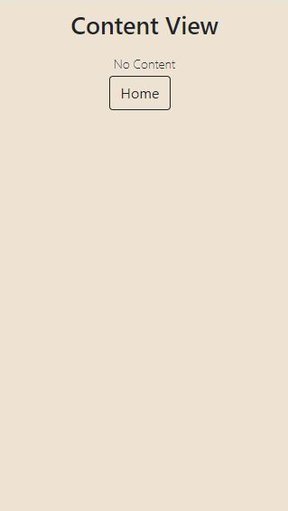
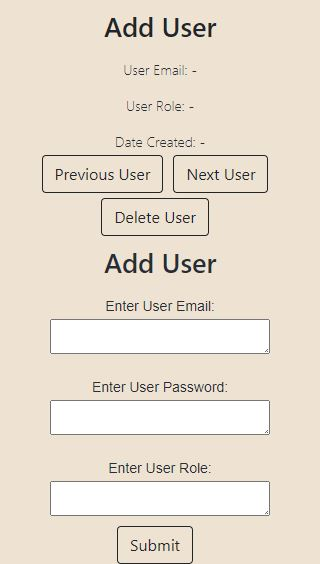
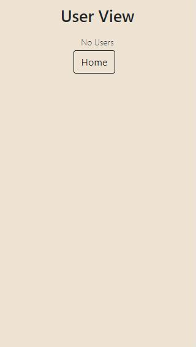

## Content Management System
A React App to manage content and users

### Tech used:
- Express used for the back end APIs
- Postgres for the database
  - Postgres extension pgcrypto for encryption
- Jest to test back end
- React for the front end (create-react-app)
- Jest/React Testing Library for testing
- Bootstrap for styling

### To run the CMS
1. Clone the Git repo to your local directory
2. Move to the root directory and run ```npm install```
3. Ensure postgres is installed, then create a postgres user with database creation permissions.
4. Create the databases, extensions and tables as per the instructions [here](db-schema.sql)
5. Create .env file with variables PG_USER, PG_PASSWORD (use the credentials for the postgres user set up in step 4), PORT (use pg default port) and NODE_ENV=production
6. To run the app go to the parent directory and run ```npm start```
7. Go to localhost:3002 in your web browser

##### Tests
- Express API back end test coverage:

File         | % Stmts | % Branch | % Funcs | % Lines | Uncovered Line #s
-------------|---------|----------|---------|---------|---------------------
All files    |   91.78 |    95.45 |     100 |   91.78 |
 database.js |     100 |       50 |     100 |     100 | 9
 index.js    |   91.18 |      100 |     100 |   91.18 | 20,32,75,89,101,144
 
- React Front end coverage

File                | % Stmts | % Branch | % Funcs | % Lines | Uncovered Line #s 
--------------------|---------|----------|---------|---------|-------------------
All files           |   67.76 |    69.05 |   75.44 |   71.76 | 

### Screenshots






### Project Summary
#### Functionality included:
- Adding and deleting users and content.
- APIs created for GET/POST/PUT/DELETE for both users and content.  
- Password encryption in the PG database.  
- Some interactivity such as navigation to home screen and cycling through users or content.  
- CSS styling.
- Edge cases considered e.g. app continues when no data in database, broken number sequence of record ids due to data deletion guarded against when cycling through records, input form text box size variability using text area.   
- Styled with a focus on mobile view as shown in screenshots above.  

#### Areas for improvement:
- Fix tests for front end